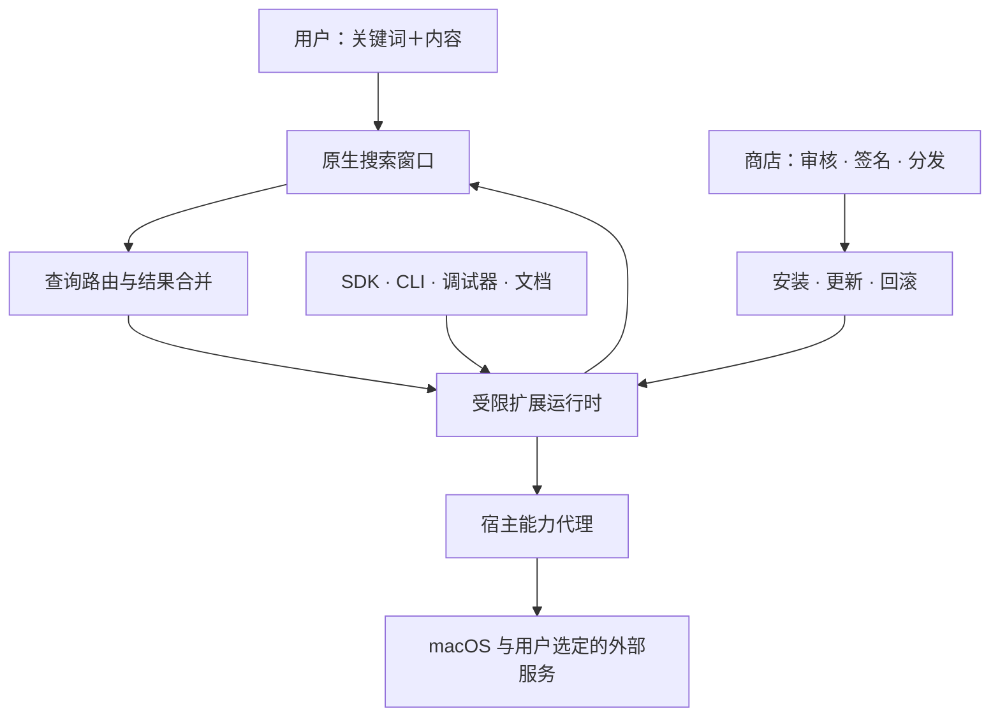

# 独立启动器平台方案 · 已确认，开发中

版本：0.1 已确认方案 · 2026-09-28

目标：做一个可日常使用的 macOS 启动器与扩展平台。检索类扩展支持「关键词＋内容 → 主框实时结果 → 选择执行」，窗口、列表和操作面板使用统一的原生界面。

用户已确认开始开发。当前已落地独立 macOS 开发预览、受限执行服务、SDK 0.1、CLI、本地安装/升级/回滚及有道适配器。本文保留完整目标；实际实现和未验收项以 [开发文档](docs/developer/README.md) 与 [验证记录](docs/developer/VALIDATION.md) 为准。公开商店、云服务等后续能力尚未实现。

## 插件底座原则

**用户功能全部由插件实现。** 底座只保留窗口/输入/渲染、插件生命周期、路由、权限、运行时、SDK 与系统能力代理。应用搜索、计算、翻译、文本处理以及未来 AI 等都采用相同插件机制；随附插件也可启停与卸载。具体边界见 [插件底座架构约束](docs/architecture/PLUGIN-FOUNDATION.md)。

## 已确认的核心方案

| 决策 | 建议方案 | 对使用和开发的影响 |
| --- | --- | --- |
| 产品形态 | 独立 macOS 原生应用，先个人使用，再开放生态 | 提供全局唤起、系统集成和原生列表 |
| 交互 | 主搜索结果为主，复杂工作区为辅 | `yd apple` 直接显示结果；只有编辑、管理、多轮对话才展开页面 |
| 外观 | 窗口、字体、行密度、详情区和操作面板保持一致 | 按应用界面规范与实际场景截图验收 |
| 扩展语言 | TypeScript；结构化结果 SDK 先行，React 声明式 UI 随后提供 | 简单搜索扩展无需写界面，复杂扩展可用组件 |
| 扩展运行时 | 标准扩展采用受限 JavaScriptCore 执行服务，能力通过宿主代理 | 公共扩展不直接获得 Node.js 的磁盘、进程和网络权限；需验证沙箱和调试链路 |
| 系统脚本 | 单独的本地可信脚本模式 | 能运行用户自己的脚本，但不与公共商店标准扩展混用信任模型 |
| 扩展兼容 | 自有 SDK；优先适配 Script Filter 数据格式 | 外部扩展须按兼容清单迁移，不承诺原样安装 |
| 应用商店 | 本地包安装 → 自有测试仓库 → 公开商店 | 安装、升级、回滚、审核、撤回一起设计；商城页面只是其中一层 |
| AI 与翻译 | 服务适配器，首个真实业务扩展用有道官方 API | 凭据由用户配置，外部服务由插件接入 |
| 数据 | 本地优先；同步为独立可选服务 | 离线仍可启动应用、搜索本地内容；云功能不会阻塞基础能力 |

技术选型是本方案的建议，确认后先做运行时验证。沙箱、中文输入法、全局焦点和调试能力验证不通过时，应更新架构决策再进入正式开发。

## 完整产品由六部分构成

1. **桌面底座**：主搜索、动作面板、底座设置与插件管理；工具和 AI 功能由插件渲染。
2. **扩展平台**：命令注册、实时查询、组件渲染、能力权限、生命周期、安装与更新。
3. **开发者工具**：SDK、CLI、脚手架、热重载、日志、断点调试、测试、打包。
4. **文档中心**：入门教程、API 参考、组件示例、调试手册、迁移指南、发布规范、版本说明。
5. **应用商店**：发现、搜索、详情、安装、更新、作者后台、审核、举报、撤回。
6. **平台服务**：身份与发布者管理、签名与分发、可选同步、诊断及后续团队能力。

## 第一阶段必须证明什么

不是先堆齐工具入口，而是完成一个贯穿平台的真实用例：

**用自有 CLI 创建有道翻译扩展 → 热重载调试 → 打包 → 在独立应用安装 → 主框输入 `yd apple` → 多条结果出现 → 选择并复制 → 升级扩展 → 回滚旧版。**

这个用例在 Vectracast 主窗口内完成。开发者按文档从空目录能重现同样流程，创建、运行、安装、升级与回滚各环节均须验收。

## 文档导航

| 文档 | 内容 |
| --- | --- |
| [产品与交互](docs/platform/PRODUCT.md) | 功能全景、首发与后续范围、键盘协议、翻译等具体场景 |
| [技术架构](docs/platform/ARCHITECTURE.md) | 原生应用、运行时、查询管线、权限、存储、技术验证 |
| [SDK 与开发者体验](docs/platform/SDK-SPEC.md) | manifest、查询/执行接口、组件、CLI、调试、文档体系 |
| [扩展商店与分发](docs/platform/MARKETPLACE.md) | 安装包、发布审核、签名、更新、回滚、作者后台 |
| [交付阶段与验收](docs/platform/DELIVERY.md) | 依赖顺序、各阶段完成标准、验证矩阵、待确认项 |

## 当前证据与边界

- 查询返回结构化结果，动作在用户选择后执行；标准扩展通过统一接口接入主搜索。
- 服务凭据由用户配置，商店分发与云服务按独立阶段建设。
- 下文列出的是完整目标体系和分期方案，不表示所有功能都能在首版交付，也不表示未经验证的兼容性已经成立。
