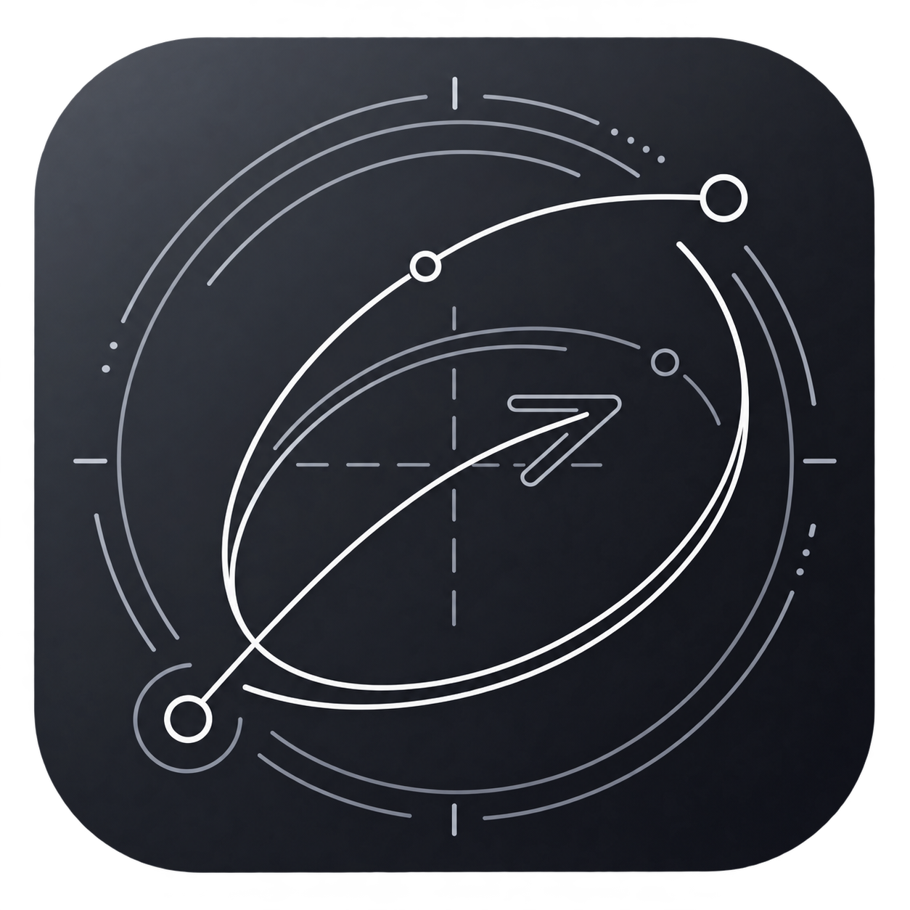
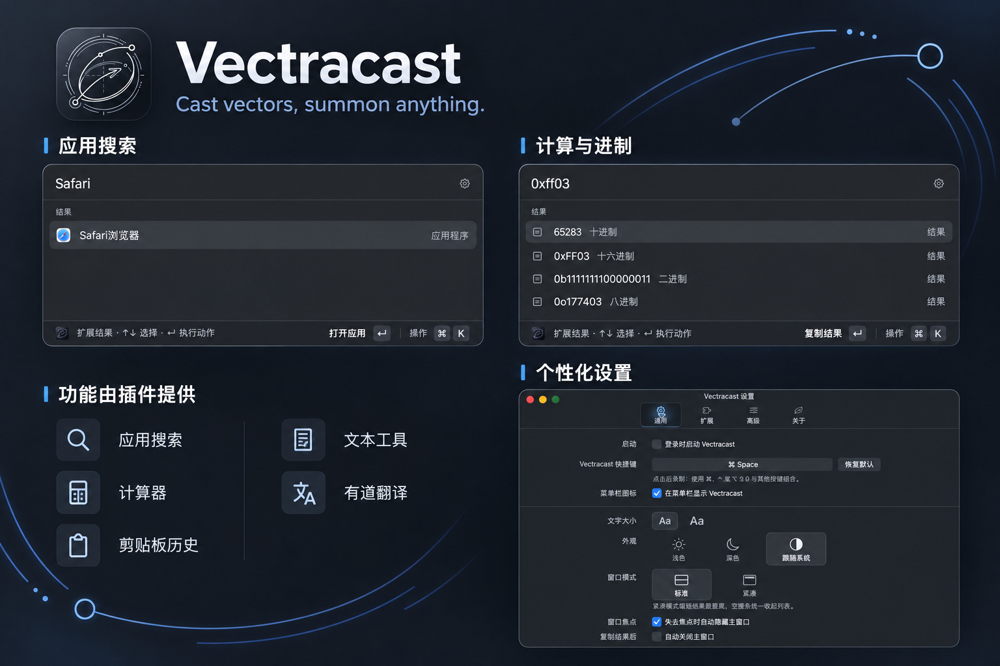

<p align="center">
  
</p>

<h1 align="center">Vectracast</h1>

<p align="center"><strong>Cast vectors, summon anything.</strong></p>

<p align="center">一个以插件为核心的原生 macOS 启动器。<br />搜索应用、计算、翻译、找回剪贴板内容，都从同一个输入框开始。</p>

<p align="center">
  
  
  
  <a href="LICENSE"></a>
</p>

<p align="center">
  <a href="#features">功能介绍</a> ·
  <a href="#getting-started">安装运行</a> ·
  <a href="docs/developer/README.md">插件开发</a> ·
  <a href="CONTRIBUTING.md">参与贡献</a> ·
  <a href="docs/developer/RELEASING.md">版本发布</a>
</p>



<p align="center"><sub>基于应用界面制作的功能总览图。原始截图：<a href="docs/design/vectracast-search.jpg">应用搜索</a> · <a href="docs/design/vectracast-calculator.jpg">计算器</a> · <a href="docs/design/vectracast-general.jpg">设置</a></sub></p>

<a id="features"></a>

## 功能介绍

用快捷键唤起 Vectracast，直接输入内容。按方向键选择结果，回车执行，`⌘K` 打开操作菜单。窗口支持浅色、深色和跟随系统外观，也可以调整字号、快捷键与窗口行为。

| 插件 | 可以做什么 | 试着输入 |
| --- | --- | --- |
| 插件商店 | 搜索公开插件目录、分类筛选、查看详情、安装和更新插件 | `store`、`plugins`、`插件商店` |
| 应用搜索 | 按中文、英文、拼音或首字母查找应用；打开、收藏或在 Finder 中查看 | `Safari`、`微信`、`weixin` |
| 计算器 | 四则运算、括号表达式、中文运算符与二／八／十／十六进制转换，无需命令前缀 | `12 * (100) + 50`、`100 乘 200`、`0xff03` |
| 剪贴板历史 | 搜索文本、链接和图片，按类型筛选、预览并复制；本地最多保留 200 条、7 天 | `cb`、`history`、`剪贴板历史` |
| 文本工具 | 转换文本大小写，选择结果后复制 | `up Hello World` |
| 有道翻译 | 在主窗口查看译文，使用自己的有道应用 ID 和密钥 | `yd apple` |

### 功能由插件提供

Vectracast 负责窗口、输入、插件管理和系统能力。应用搜索、计算器等功能均通过同一套插件机制实现，可以分别安装、停用、升级与回滚。

通过「设置 → 扩展 → 发现插件」打开商店，或输入 `store` 搜索和安装插件。你也可以在 [插件仓库](https://github.com/Vectracast/Vectracast-Plugins) 查看源码、使用说明和发布记录。

插件声明所需权限，安装时展示给用户。剪贴板记录保存在本机，停用插件后停止记录；有道翻译会将待译文本发送到有道服务，应用密钥存入 macOS 钥匙串。

想写自己的插件，可以从 [开发入门](docs/developer/README.md) 开始，或查看仓库里的 [插件示例](extensions)。

<a id="getting-started"></a>

## 安装运行

当前为开发预览版。安装包发布在 [Vectracast Releases](https://github.com/Vectracast/Vectracast/releases)；应用内「检查更新」会显示新版说明并打开下载地址，下载后手动替换应用。

也可以源码构建。需要 Apple Silicon Mac、macOS 13.3 或更新版本、Xcode Command Line Tools，以及 Node.js 和 npm；开发环境使用 Node.js 24。

克隆时使用 `--recurse-submodules` 获取插件源码。在仓库根目录执行：

```sh
npm ci
npm run build
```

构建会携带插件商店安装包。也可以打包其他五个插件进行本地安装，然后打开应用：

```sh
for plugin in applications calculator clipboard-history text-tools youdao; do
  npm run platform -- pack "extensions/$plugin" || break
done
open build/Vectracast.app
```

在「设置 → 扩展 → 安装扩展」中，选择 `extensions/<插件目录>/dist/` 下生成的 `.launcher-extension` 文件，查看权限后安装。有道翻译的凭据在插件设置中填写。

默认唤起快捷键是 `⌃⌥ Space`，可在「设置 → 通用」中修改；如果与系统或其他应用冲突，请录制一个未占用的组合键。插件运行不需要 Node.js，它只用于开发和打包。

本地构建使用 ad-hoc 签名，尚未提供正式签名与公证的发行包。

## 参与贡献

欢迎提交问题、改进界面或编写插件。报告问题时，请附上 macOS 版本、复现步骤，以及必要的截图或错误信息。

提交改动前，在仓库根目录运行：

```sh
npm run check
npm run build
npm test
npm run platform -- doctor
```

构建完成后再运行测试。界面改动还需要打开应用，检查对应页面和键盘操作。分支、提交和 push 的步骤见 [贡献指南](CONTRIBUTING.md)。两个公开仓库的创建、子模块连接和自动发布配置见 [发布指南](docs/developer/RELEASING.md)。

## 开源协议

Vectracast 采用 [MIT License](LICENSE)。第三方依赖及应用截图中展示的其他产品标识，仍归各自权利人所有。
